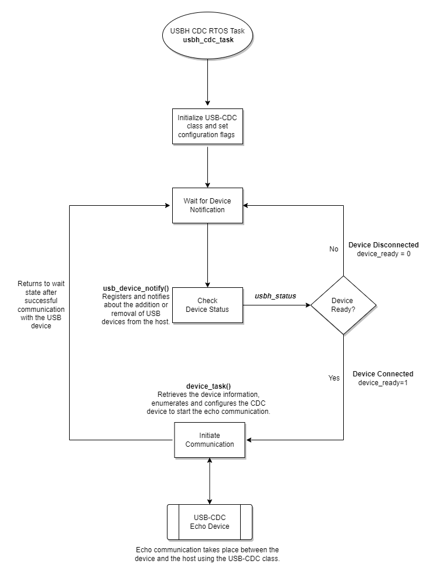

[Click here](../README.md) to view the README.

## Design and implementation

The design of this application is minimalistic to get started with code examples on PSOC&trade; Edge MCU devices. All PSOC&trade; Edge E84 MCU applications have a dual-CPU three-project structure to develop code for the CM33 and CM55 cores. The CM33 core has two separate projects for the secure processing environment (SPE) and non-secure processing environment (NSPE). A project folder consists of various subfolders, each denoting a specific aspect of the project. The three project folders are as follows:

**Table 1. Application projects**

Project | Description
--------|------------------------
*proj_cm33_s* | Project for CM33 secure processing environment (SPE)
*proj_cm33_ns* | Project for CM33 non-secure processing environment (NSPE)
*proj_cm55* | CM55 project

 

In this code example, at device reset, the secure boot process starts from the ROM boot with the secure enclave (SE) as the root of trust (RoT). From the secure enclave, the boot flow is passed on to the system CPU subsystem where the secure CM33 application starts. After all necessary secure configurations, the flow is passed on to the non-secure CM33 application. 

This code example uses the FreeRTOS on the CM33 CPU. The following tasks are created in main.c:

- **USB host CDC task:** Initializes emUSB host stack with CDC class and waits for USB-device connection
- **USB host task:** This task iterates over the list of active timers and invokes the registered callback functions in case the timer has expired
- **USB host ISR task:** This task waits for events from the interrupt handler of the host controller and processes them

The main function is responsible for initializing the device, ports, and all other required peripherals. It creates the USB host CDC task `usbh_cdc_task`, which is responsible for initializing the emUSB host middleware stack with CDC class. 

The emUSB host stack utilizes two dedicated RTOS tasks. These tasks are created using FreeRTOS for this code example. The first task `usbh_task` is responsible for managing the internal software timers. It calls the target `API USBH_Task()` and also invokes the registered callback functions, if the timer runs out. The second task, `usbh_isr_task` calls the target `USBH_ISRTask()` API, processes the interrupts generated by the USB host controller and treats it as a highest priority. 

The priorities of both tasks have to be higher than the priority of any other application task which uses emUSB host. For more information regarding the usage of emUSB host target APIs, refer to the [emUSB host user guide](https://github.com/Infineon/emusb-host/blob/master/docs/UM10001_emUSBH.pdf) (locally available at *<mtb_shared>/emusb-host/<version-tag>/docs*)

The `usbh_cdc_task()` routine then sets the configuration flags and gets into a wait state requesting the status of the USB bus using the `USBH_CDC_AddNotification` target API and `usb_device_notify` application function. The USB host slowly blinks the user LED indicating the wait state. 

When a USB CDC device with echo functionality is connected to the host via a USB cable, the `usb_device_notify` application function sets a non-zero value for `device_ready` and then the firmware initiates `device_task()`, which handles the echo communication. The `device_task()` routine retrieves the device information, enumerates, and configures the CDC device to start the echo communication. It also configures the data packets that are sent by the host to the device. The USB host sends a string data packet using `USBH_CDC_Write` target API. The echo communication is successful when the USB CDC device echoes the packet back to the host. This is done using the `USBH_CDC_Read` target API. The host prints the logs accordingly on the terminal. The host waits for 5 seconds after which it re-initiates the echo communication to the USB device. This process continues until the USB device is physically disconnects. When the device disconnects, `usb_device_notify` application function sets a zero value for `device_ready`, and the `usbh_cdc_task()` goes to the wait state till the next connection between the host and device occurs. 

**Figure 1. USB host CDC task flow diagram**

